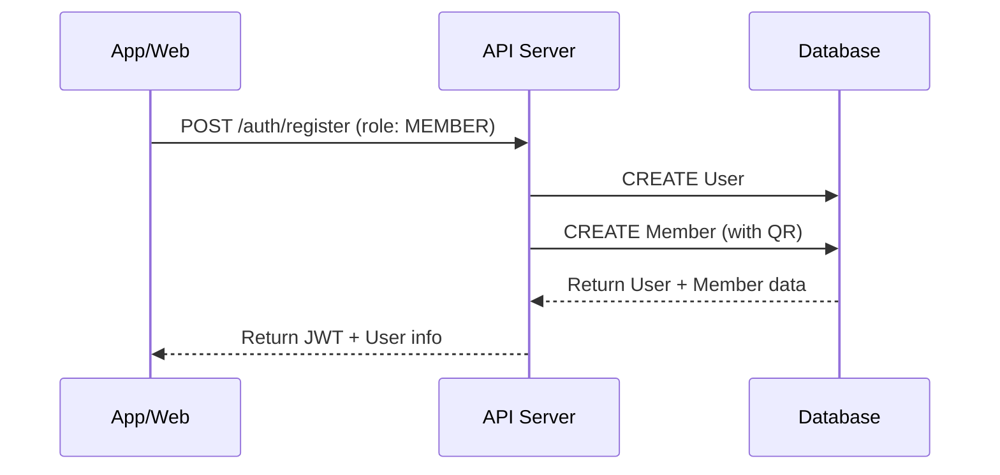
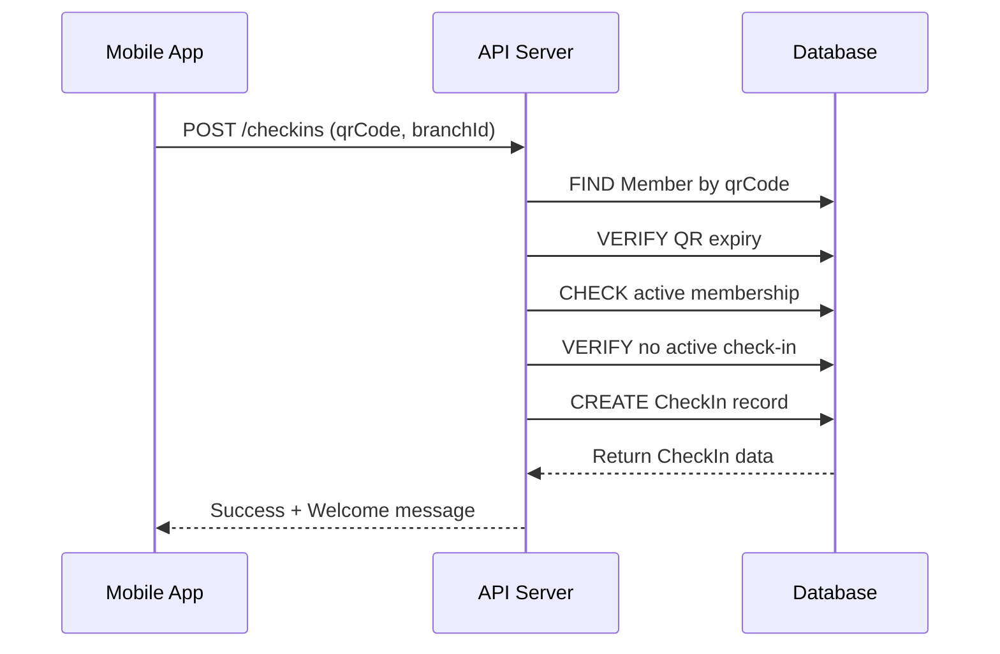
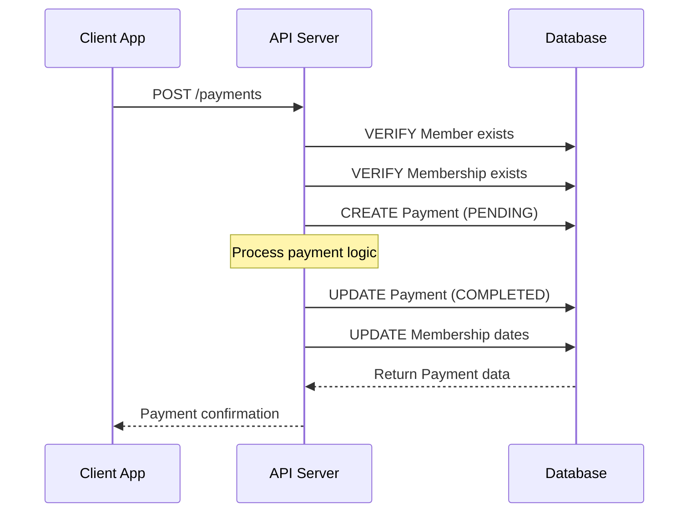

# 🎨 Diagrama Visual de Base de Datos - GymMaster

## 📊 Diagrama Entidad-Relación Detallado

```mermaid
erDiagram
    %% Entidades Principales
    USER {
        uuid id PK
        string email UK
        string password
        string firstName
        string lastName
        string phone
        string photo
        UserRole role
        boolean isActive
        boolean emailVerified
        datetime lastLogin
        datetime createdAt
        datetime updatedAt
    }

    BRANCH {
        uuid id PK
        string name
        string address
        string phone
        string email
        string city
        string state
        string zipCode
        boolean isActive
        string openingTime
        string closingTime
        uuid createdById FK
        datetime createdAt
        datetime updatedAt
    }

    EMPLOYEE {
        uuid id PK
        uuid userId FK,UK
        uuid branchId FK
        string position
        decimal salary
        datetime hireDate
        boolean isActive
        datetime createdAt
        datetime updatedAt
    }

    TRAINER {
        uuid id PK
        uuid userId FK,UK
        uuid branchId FK
        string[] specialties
        int experience
        string certification
        decimal hourlyRate
        boolean isActive
        string bio
        datetime createdAt
        datetime updatedAt
    }

    MEMBER {
        uuid id PK
        uuid userId FK,UK
        string membershipNumber UK
        datetime dateOfBirth
        string emergencyContact
        string emergencyPhone
        string medicalNotes
        string qrCode UK
        datetime qrCodeExpiry
        boolean isActive
        datetime joinDate
        datetime createdAt
        datetime updatedAt
    }

    MEMBERSHIP_TYPE {
        uuid id PK
        string name UK
        string description
        int durationDays
        decimal price
        string[] features
        boolean isActive
        int maxClasses
        datetime createdAt
        datetime updatedAt
    }

    MEMBERSHIP {
        uuid id PK
        uuid memberId FK
        uuid membershipTypeId FK
        datetime startDate
        datetime endDate
        MembershipStatus status
        boolean autoRenew
        string notes
        datetime createdAt
        datetime updatedAt
    }

    CHECK_IN {
        uuid id PK
        uuid memberId FK
        uuid branchId FK
        datetime checkInAt
        datetime checkOutAt
        string notes
        datetime createdAt
    }

    CLASS {
        uuid id PK
        string name
        string description
        uuid branchId FK
        uuid trainerId FK
        int capacity
        int duration
        datetime startTime
        datetime endTime
        ClassStatus status
        boolean isRecurring
        decimal price
        datetime createdAt
        datetime updatedAt
    }

    RESERVATION {
        uuid id PK
        uuid memberId FK
        uuid classId FK
        uuid trainerId FK
        ReservationStatus status
        string notes
        datetime createdAt
        datetime updatedAt
    }

    PAYMENT {
        uuid id PK
        uuid memberId FK
        uuid membershipId FK
        uuid branchId FK
        decimal amount
        PaymentMethod method
        PaymentStatus status
        string description
        string reference
        datetime paymentDate
        datetime dueDate
        string notes
        datetime createdAt
        datetime updatedAt
    }

    AUDIT_LOG {
        uuid id PK
        uuid userId FK
        string action
        string entity
        uuid entityId
        json oldValues
        json newValues
        datetime timestamp
        string ipAddress
        string userAgent
    }

    %% Relaciones
    USER ||--o{ BRANCH : "creates"
    USER ||--o| EMPLOYEE : "is"
    USER ||--o| TRAINER : "is"
    USER ||--o| MEMBER : "is"
    
    BRANCH ||--o{ EMPLOYEE : "works_at"
    BRANCH ||--o{ TRAINER : "works_at"
    BRANCH ||--o{ CHECK_IN : "occurs_at"
    BRANCH ||--o{ CLASS : "held_at"
    BRANCH ||--o{ PAYMENT : "processed_at"
    
    MEMBER ||--o{ MEMBERSHIP : "has"
    MEMBER ||--o{ CHECK_IN : "performs"
    MEMBER ||--o{ RESERVATION : "makes"
    MEMBER ||--o{ PAYMENT : "makes"
    
    MEMBERSHIP_TYPE ||--o{ MEMBERSHIP : "type_of"
    
    MEMBERSHIP ||--o{ PAYMENT : "for"
    
    TRAINER ||--o{ CLASS : "teaches"
    TRAINER ||--o{ RESERVATION : "assists"
    
    CLASS ||--o{ RESERVATION : "reserved_for"
    
    USER ||--o{ AUDIT_LOG : "performs"
```

## 🔄 Flujos de Datos Principales

### 1. Flujo de Registro de Miembro


### 2. Flujo de Check-in con QR


### 3. Flujo de Pago de Membresía


## 📈 Patrones de Consulta Comunes

### 🔍 Consultas de Rendimiento Crítico

#### 1. Validación de QR para Check-in
```sql
-- Índice requerido: members(qr_code, qr_code_expiry, is_active)
SELECT 
    m.id, m.user_id, m.membership_number,
    u.first_name, u.last_name,
    ms.status, ms.end_date
FROM members m
JOIN users u ON m.user_id = u.id
LEFT JOIN memberships ms ON m.id = ms.member_id 
    AND ms.status = 'ACTIVE'
    AND ms.start_date <= NOW() 
    AND ms.end_date >= NOW()
WHERE m.qr_code = ? 
    AND m.qr_code_expiry > NOW() 
    AND m.is_active = true;
```

#### 2. Dashboard de Sucursal en Tiempo Real
```sql
-- Múltiples índices requeridos para optimización
WITH daily_stats AS (
    SELECT 
        COUNT(*) as today_checkins,
        COUNT(DISTINCT member_id) as unique_visitors
    FROM check_ins 
    WHERE branch_id = ? 
        AND DATE(check_in_at) = CURRENT_DATE
),
active_members AS (
    SELECT COUNT(*) as active_count
    FROM check_ins 
    WHERE branch_id = ? 
        AND check_out_at IS NULL
),
monthly_revenue AS (
    SELECT SUM(amount) as revenue
    FROM payments 
    WHERE branch_id = ? 
        AND status = 'COMPLETED'
        AND DATE_TRUNC('month', payment_date) = DATE_TRUNC('month', CURRENT_DATE)
)
SELECT * FROM daily_stats, active_members, monthly_revenue;
```

#### 3. Reporte de Membresías por Expirar
```sql
-- Índice: memberships(status, end_date)
SELECT 
    u.first_name, u.last_name, u.email, u.phone,
    m.membership_number,
    ms.end_date,
    mt.name as membership_type,
    EXTRACT(DAYS FROM ms.end_date - CURRENT_DATE) as days_remaining
FROM memberships ms
JOIN members m ON ms.member_id = m.id
JOIN users u ON m.user_id = u.id
JOIN membership_types mt ON ms.membership_type_id = mt.id
WHERE ms.status = 'ACTIVE'
    AND ms.end_date BETWEEN CURRENT_DATE AND (CURRENT_DATE + INTERVAL '30 days')
ORDER BY ms.end_date ASC;
```

## 🏗️ Arquitectura de Datos

### Capas de la Aplicación
```
┌─────────────────────────────────────┐
│           Frontend Apps             │
│  (React Native, C# WPF, Web)       │
└─────────────────┬───────────────────┘
                  │ HTTP/REST API
┌─────────────────▼───────────────────┐
│            API Layer                │
│  (Express.js + Middleware)         │
├─────────────────────────────────────┤
│         Business Logic              │
│     (Services + Controllers)       │
├─────────────────────────────────────┤
│          Data Access                │
│         (Prisma ORM)                │
└─────────────────┬───────────────────┘
                  │ SQL Queries
┌─────────────────▼───────────────────┐
│         PostgreSQL Database         │
│    (Tables + Indexes + Views)      │
└─────────────────────────────────────┘
```

### Estrategia de Backup
```
Nivel 1: Backup Completo Diario
├── Tablas principales (users, members, branches)
├── Datos transaccionales (check_ins, payments)
└── Configuración (membership_types, classes)

Nivel 2: Backup Incremental (cada 4 horas)
├── check_ins (alta frecuencia)
├── payments (crítico para negocio)
└── audit_logs (trazabilidad)

Nivel 3: Replicación en Tiempo Real
├── Master-Slave para lecturas
├── Failover automático
└── Sincronización cross-region
```

## 🔐 Seguridad de Datos

### Encriptación
- **En Tránsito**: TLS 1.3 para todas las conexiones
- **En Reposo**: Encriptación a nivel de disco (AES-256)
- **Datos Sensibles**: Campos específicos encriptados en aplicación

### Control de Acceso
```sql
-- Roles de base de datos
CREATE ROLE gymmaster_read;
CREATE ROLE gymmaster_write;
CREATE ROLE gymmaster_admin;

-- Permisos granulares
GRANT SELECT ON ALL TABLES TO gymmaster_read;
GRANT INSERT, UPDATE ON transactional_tables TO gymmaster_write;
GRANT ALL PRIVILEGES ON ALL TABLES TO gymmaster_admin;

-- Row Level Security para multi-tenancy
ALTER TABLE check_ins ENABLE ROW LEVEL SECURITY;
CREATE POLICY branch_isolation ON check_ins 
    FOR ALL TO gym_employee 
    USING (branch_id = current_user_branch());
```

### Auditoría Completa
```sql
-- Trigger para auditoría automática
CREATE OR REPLACE FUNCTION audit_trigger()
RETURNS TRIGGER AS $$
BEGIN
    INSERT INTO audit_logs (
        user_id, action, entity, entity_id, 
        old_values, new_values, timestamp
    ) VALUES (
        current_user_id(), TG_OP, TG_TABLE_NAME, 
        COALESCE(NEW.id, OLD.id),
        CASE WHEN TG_OP = 'DELETE' THEN row_to_json(OLD) END,
        CASE WHEN TG_OP != 'DELETE' THEN row_to_json(NEW) END,
        NOW()
    );
    RETURN NULL;
END;
$$ LANGUAGE plpgsql;

-- Aplicar a tablas críticas
CREATE TRIGGER audit_users AFTER INSERT OR UPDATE OR DELETE ON users
    FOR EACH ROW EXECUTE FUNCTION audit_trigger();
```

## 📊 Métricas y Monitoreo

### KPIs de Base de Datos
```sql
-- Consultas de monitoreo para dashboard administrativo

-- 1. Salud del Sistema
SELECT 
    schemaname,
    tablename,
    n_tup_ins as inserts,
    n_tup_upd as updates,
    n_tup_del as deletes,
    n_live_tup as live_rows,
    n_dead_tup as dead_rows
FROM pg_stat_user_tables
ORDER BY n_live_tup DESC;

-- 2. Rendimiento de Consultas
SELECT 
    query,
    calls,
    total_time,
    mean_time,
    rows
FROM pg_stat_statements
ORDER BY total_time DESC
LIMIT 10;

-- 3. Uso de Índices
SELECT 
    indexrelname,
    idx_scan,
    idx_tup_read,
    idx_tup_fetch
FROM pg_stat_user_indexes
ORDER BY idx_scan DESC;
```

### Alertas Automatizadas
```sql
-- Membresías por expirar (ejecutar diariamente)
SELECT COUNT(*) as expiring_memberships
FROM memberships 
WHERE status = 'ACTIVE' 
    AND end_date BETWEEN CURRENT_DATE AND (CURRENT_DATE + INTERVAL '7 days');

-- Check-ins sin salida (ejecutar cada hora)
SELECT COUNT(*) as stuck_checkins
FROM check_ins 
WHERE check_out_at IS NULL 
    AND check_in_at < (NOW() - INTERVAL '12 hours');

-- Pagos pendientes (ejecutar cada 30 minutos)
SELECT COUNT(*) as pending_payments
FROM payments 
WHERE status = 'PENDING' 
    AND created_at < (NOW() - INTERVAL '1 hour');
```

Esta documentación visual complementa la documentación técnica y proporciona una visión clara de la arquitectura y flujos de datos del sistema GymMaster.